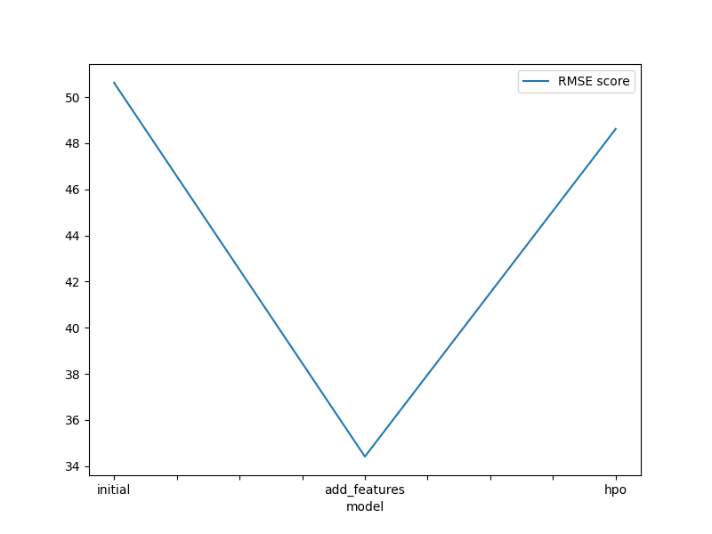
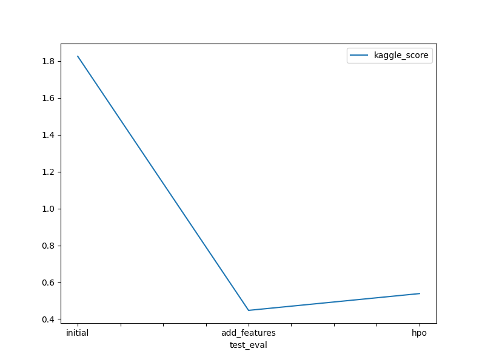

# Report: Predict Bike Sharing Demand with AutoGluon Solution
#### Malgorzata Balcerzak

## Initial Training
### What did you realize when you tried to submit your predictions? What changes were needed to the output of the predictor to submit your results?

The experiment list:  
1. Initial Submission (`initial`)
2. Added features (`feature_added`)
3. Hyperparameter Optimisation (`HPO`)

**Realisation** : Sometimes the prediction velues were negative and Kaggle does mot accept negative values as answers  
**Change** : I replaced the negative prediction values with 0 just in case

### What was the top ranked model that performed?
Top ranked model was found after adding new features - **WeightedEnsemble_L3** that was developed  (RMSE of 34.42) and kaggle score of 0.44715. Ensemble models often outperform singular models due to their ability to combine the strengths of multiple individual models, mitigating their weaknesses and improving overall predictive power. They aggregate the predictions to create a final, more accurate one (as in this case). 

## Exploratory data analysis and feature creation
### What did the exploratory analysis find and how did you add additional features?

1. `datetime` was read as datetime datatype from the csv and then parsed into `year`, `month`,`day`,`hour`. I dropped the `datetime` feature since all the information was incorporated into new features
2. Variables `season`,`weather` were orignally integers but should be categorical so that was changed. 
3. Features `temp` and `atemp` are highly correlated so I removed `atemp`(Pearson correlation: 0.98, metric used for linear correlation)
4. The instruction told us to ignore `casual` and `registered` features since they are not present in the test dataset so I removed them from the train DataFrame
5. The catplot for `hour` seems to show increased activity during morning and evening hours. People using bikes might be commuting to/from work or university. 
6. People rent bikes most frequently in the summer and least frequently in winter
7. Preferred weather to rent a bike seems to be category 1 (*Clear, Few clouds, Partly cloudy, Partly cloudy*) irrespective of the season. I also noticed that the category 4 is present in the dataset only once - maybe this category can be incorporated into another one to save information clutter. 
8. `hour` variable can be turned into a categorical variable - bins are called ['night', 'early_morning', 'morning', 'lunch', 'afternoon','evening']

### How much better did your model preform after adding additional features and why do you think that is?
Adding additional features and changing hyperparameters definitely led to a direct improvement both in evaluation metrics locally and in the kaggle score. Looking at Kaggle score it went from 1.83 to 0.44 (which woudl mean around ~1055 place on the leaderboard at the time of wrighting that sentence, top 33%). For example splitting datetime into more features enabled the model to extract more information from the data. Instead of a big number we got day of the week, month, yeah, time that the bike was rented... Removing unnecessary variables caused the dataset to be smaller and the model could focus on learning from more valuable data. 

## Hyper parameter tuning
### How much better did your model preform after trying different hyper parameters?
Finding the optimal combination of hyperparameter valuescan lead to the best performance on a specific task or dataset. This process is essential because choosing appropriate hyperparameters can lead to better convergence, reduced overfitting, and improved generalization of the model. However, hyperparameter tuning is often challenging... Manually testing various hyperparameters is a time-consuming task and requires a lot of trial and error and sometimes we might obtain a result not much better than the out-of-the-box model that we started with. The final models after hyperparameter tuning achieved higher performance than the original, baseline model but   

### If you were given more time with this dataset, where do you think you would spend more time?
I would spend more time on data cleaning and feature engineering. AutoGluon is a powerful tool that is able to provide a good-enough model from provided dataset but as we know "garbage in -> garbage out" so making sure data represent the real wold as closely as possible would be of utmost importance. 

### Create a table with the models you ran, the hyperparameters modified, and the kaggle score.
|model|hpo1|hpo2|hpo3|score|
|--|--|--|--|--|
|initial|presets="best_quality", |time_limit=600|...| 1.82602 |
|add_features|presets="best_quality", |time_limit=600|...|0.44715|
|hpo|presets="high_quality", 'num_trials': 20, 'searcher': 'auto', 'scheduler': 'local'|time_limit=900|'objective': 'reg:squarederror', 'eval_metric': 'rmse', 'n_estimators':2, 'learning_rate':1, 'eta':3,'subsample':1, 'colsample_bytree': 1|0.53818|

### Create a line plot showing the top model score for the three (or more) training runs during the project.

### Create a line plot showing the top kaggle score for the three (or more) prediction submissions during the project.

## Summary
- AutoGluon AutoML framework is a powerful tool that enables Data Scientists to test their ideas fast and release prototypes more efficiently
- Results improved significantly after performing EDA and even basic feature engineering
- Hyperparameter tuning is a challenging task and sometimes the out-of-the-box solution is "good enough". The business and data science team has to assess the time and budget limits and decide whether fine tuning the model for a long time makes sense